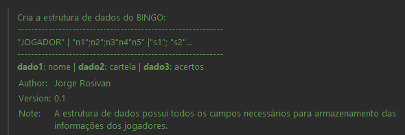
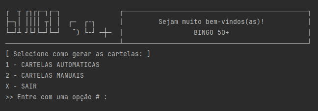
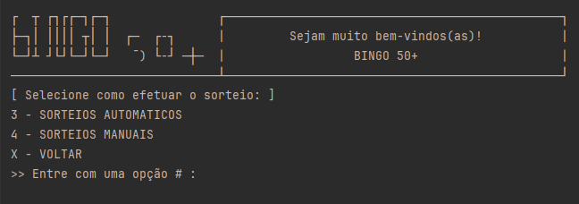

# BINGO


Jogo do BINGO. Projeto atendendo desafio do curso:<br>
### Ser + Tech Programa 50+

***Premisas:***:
```
1) Criar o jogo de BINGO usando somente Arrays, sem ajuda de Collections;

2) Orientações:
    - Mensagem de apresentacao inicial;
    - Menu com modo: manual ou auto
        * se auto - pede entrada jogadores e gera todas cartelas;
        * se manu - pede entrada jogadores e das cartelas de uma vez;
        -> Separar por hifen(-) os jogadores: player1-player2-player3
        -> Separar por ponto e virgula(;) os números: 11;17;23;39;45
        -> verificar números sorteados, até alguém fazer bingo;
        -> Apresentar estatísticas;
```
<br>

---
* Figura 1 - Sobre a Estrutura dos Dados:



* Figuras 2 e 3 - Visão geral dos menus:





---

### Sobre as Classes:

- **DadosBingo.java:** Classe responsável para criação e manipulação dos jogadores, cartelas e números sorteados.
- **MenuBingo.java:** Classe responsável pelo gerenciamento dos menus na console.


***TO-DO***:
```
1) Checagem da quantidade dos números fornecidos pelo usuário;
2) Melhorar Estatísticas;
3) Refatorar rotinas;
```
